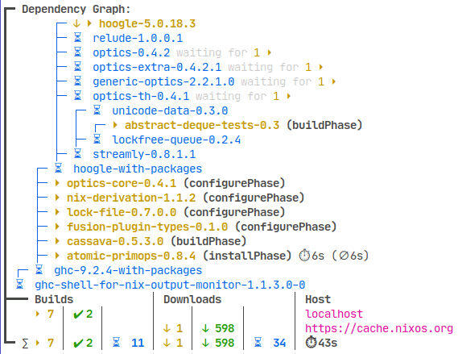

# nix-output-monitor

Pipe your nix-build output through the nix-output-monitor (aka nom) to get additional information while building.

While your build runs nom will draw something like this at the bottom of your build log:



*(note that to reduce clutter nom only shows timers over 1s build or download time.)*

[](https://repology.org/project/nix-output-monitor/versions)


## Status

This was an experimental fun project, which proofed to be useful to quite a lot of people.
The purpose of it is to write something fun and useful in Haskell.
You are free and very welcome to contribute feedback, issues or PRs. I do not commit to maintain this project over a long time period, but it doesn’t look, like I am stopping anytime soon.

By now, nom is quite fully featured with support for nix v1 commands (e.g. `nix-build`) and nix v2 command (e.g. `nix build`).

Issues and pull requests welcome under https://github.com/maralorn/nix-output-monitor.

**Call for screenshots:** I would be very glad to receive screenshot of your nom use. I never know how it looks on your machine and seeing how you use nom might help me in making the UX better.

## Support

If your question is not answered in this README you can ask it in [#nix-output-monitor:maralorn.de](https://matrix.to/#/#nix-output-monitor:maralorn.de) on matrix or open an issue here on github.

## Installing

* nixpkgs: nom is in nixpkgs. Just install `pkgs.nix-output-monitor` in the usual way. You might want to install it from nixos-unstable to get the newest version.
* cabal: Install `cabal-install` and run `cabal install` in the checked out repo.
* nix: or run `nix-build` or `nix-env` or include the `default.nix` of this repo in your nixos config.

## Running

### The Easy Way

**Warning:** The displayed build tree might be incomplete with new-style commands like `nix build` for nix versions <2.10.

The `nom` binary (starting from version 2.0) behaves as a `nix` drop in, with much more colorful output, for the following commands:

`nom build <args>`: Behaves like `nix build <args>`.  
`nom shell <args>`: Behaves like `nix shell <args>`.  
`nom develop <args>`: Behaves like `nix develop <args>`.  

The later two commands work by calling `nix shell` or `nix develop` twice, the first time with overriden `--run exit` and monitoring the output, the second time passing output through to the user. This will incur a performance cost by doubling eval time.

Furthermore when called via the corresponding provided symlinks, nom is also a drop-in for the following commands:  
`nom-build <args>`: Behaves like `nix-build <args>`.  
`nom-shell <args>`: Behaves like `nix-shell <args>`.  

All aliases internally use the json-based approach (see next section) and propagate error codes.
If you want nom support for other nix commands please open an issue.

### The Flexible Way

#### JSON based
```shell
nix-build --log-format internal-json -v |& nom --json
```
**Warning:** Don‘t forget to redirect stderr. That's what the `&`, does.

#### Human readable log parsing

It his highly recommended to always append `--log-format internal-json -v` (or use the above mentioned aliases.) and call `nom` with `--json`. That will give you much more informative output.

If you are in a situation, where you can‘t use the json based nix output you can still use
```shell
nix-build |& nom
```

**Warning:** Don‘t forget to redirect stderr. That's what the `&`, does.

This has the advantage to also work with other commands like `nixos-rebuild` or `home-manager`, where it is not trivial to pass in the `--log-format internal-json -v` flag. nom will pass everything it reads through, if it does not understand it. This makes it ideal to attach it to scripts which output more then just `nix` output.

### Preserving Colored Text

Colored text will work as expected in json-mode.

In human-readable log mode you can preserve the color of the redirected text by using the `unbuffer` command from the `expect` package.

```shell
unbuffer nix-build |& nom
```

## Explanation

### Legend

Nom tries to convey informations via symbols and colors

* `⏵`, yellow: running builds
* `✔`, green: completed builds
* `⏳︎︎︎`, blue: planned builds
* `⚠`, red: failed builds
* `↓ ⏵`, yellow: running downloads
* `↑ ⏵`, yellow: running uploads
* `↓ ✔`, green: completed downloads
* `↑ ✔`, green: completed uploads
* `↓ ⏳︎︎︎`, blue: waiting downloads
* `∅`: a moving average over past builds of this derivation
* `⏱︎`: running time
* `∑`: a summary over all packages and hosts

If you can‘t see all icons you maybe need another terminal font.
I recommend any font from `pkgs.nerdfonts` e.g. `"JetBrainsMono Nerd Font"`.
Also different terminals might work differently well. I recommend: `pkgs.foot`.

### How to Read the Dependency Graph

* Every entry in the nom tree stands for one derivation.
* Children of a node are direct dependencies.
* nom will try to show you the most relevant part of the dependency tree, roughly aiming to fill a third of your terminal
* No build will be printed twice in the tree, it will only be shown for the lower most dependency.
* nom will do it’s best to print all running or failed builds, downloads and uploads, but it does not print every direct child of a node.
* Use the colors from above to read the summary

## Example Runs

An example remote build:
[](https://asciinema.org/a/KwCh38ujQ9wusHw8kyW4KCMZo)

An example with a lot of downloads:
[](https://asciinema.org/a/7hJXH2iFLEkKxG1lL25lspqNn)

## Implementation

Right now nom uses four sources of information:

1. The parsed nix-build output (json or human-readable)
2. it checks if build results exist in the nix-store (only in human-readable mode)
3. it querys `.drv` files for information about the `out` output path.
4. It caches build times in `$XDG_CACHE_HOME/nix-output-monitor/build-reports.csv`.

## Limitations

* This will fail in unexpected and expected ways.
* Luckily I don‘t think this program screws up anything more than your terminal.
* remote builds will sometimes be shown as running even when they are actually still waiting for uploads or downloads. This is how nix reports it.
* Terminal clearing and reprinting is brittle. It might fail with your terminal or terminal width. But at this point I‘ve invested some effort to make it usable.
* This program also makes assumptions like your nix-store is at "/nix/store".

### For human-readable log parsing mode:
* nix-output-monitor receives most it's information from parsing nix-build output. The parser might be to strict or to loose for use cases I didn‘t think of. Then **the numbers displayed will be off**!
* nix-build does not show info when a download or upload is finished, so we currently cannot differentiate between started and completed downloads.
* For completed build detection we assume that every derivation has an output called "out".
